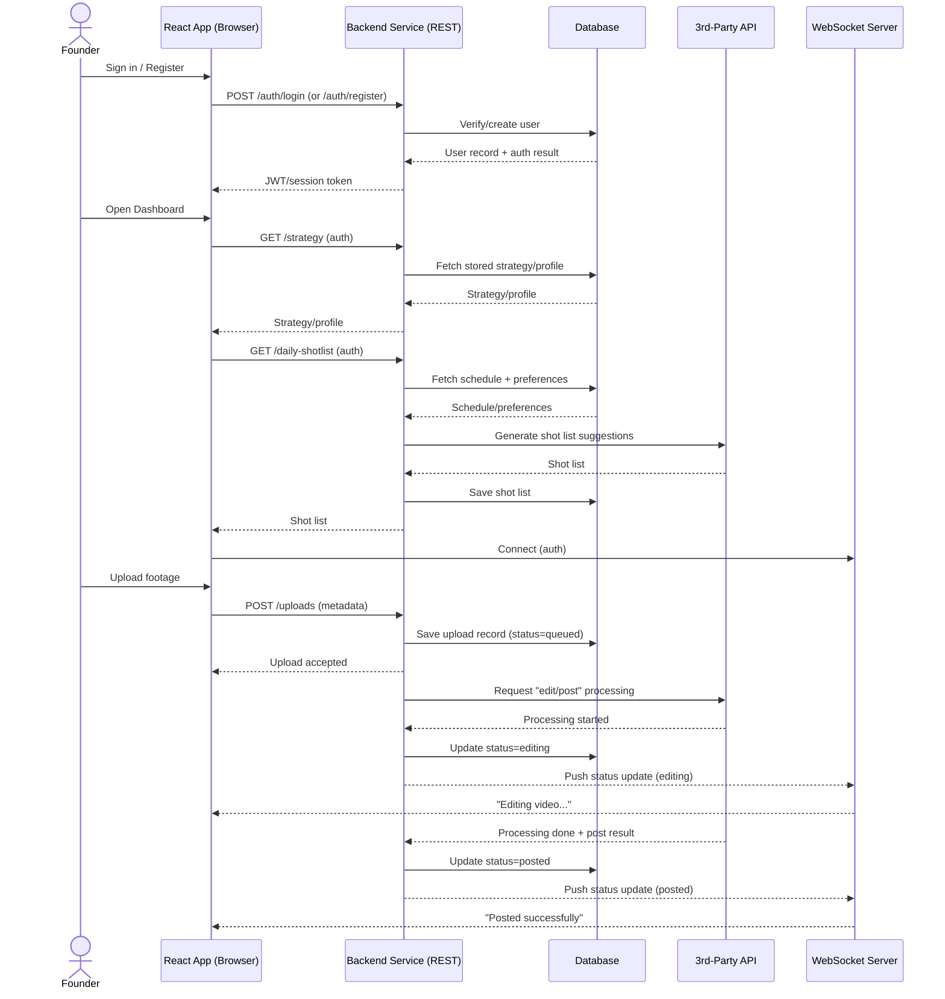

# Your startup name here

[My Notes](notes.md)

A one-stop-shop to manage social media accounts for founders creating "build-in-public" content from content planning to posting to multiple platforms.

> [!NOTE]
> This is a template for your startup application. You must modify this `README.md` file for each phase of your development. You only need to fill in the section for each deliverable when that deliverable is submitted in Canvas. Without completing the section for a deliverable, the TA will not know what to look for when grading your submission. Feel free to add additional information to each deliverable description, but make sure you at least have the list of rubric items and a description of what you did for each item.

> [!NOTE]
> If you are not familiar with Markdown then you should review the [documentation](https://docs.github.com/en/get-started/writing-on-github/getting-started-with-writing-and-formatting-on-github/basic-writing-and-formatting-syntax) before continuing.

## 🚀 Specification Deliverable

> [!NOTE]
> Fill in this sections as the submission artifact for this deliverable. You can refer to this [example](https://github.com/webprogramming260/startup-example/blob/main/README.md) for inspiration.

For this deliverable I did the following. I checked the box `[x]` and added a description for things I completed.

- [x] Proper use of Markdown
- [x] A concise and compelling elevator pitch
- [x] Description of key features
- [x] Description of how you will use each technology
- [x] One or more rough sketches of your application. Images must be embedded in this file using Markdown image references.

### Elevator pitch

BIP (build in public) automates the content creation work for startup founders. Are you a startup founder who wants to post your journey of building your company on top of the regular startup tasks you are doing? Do you ever stuggle with coming up with video ideas and hate the redundent and time consuming process of editing and posting your content? Is hiring a personal social media manager too expensive? 

BIP is your solution!

BIP will evaluate your startup and generate a founder style social media strategy. Everyday, it will tell you what shots you need to film, what to say. All you need to do is film the shots asked by BIP and BIP takes care of the editing, posting, and reusing your content. 

### Design

### Key features

- Social Media Strategy Decision: An AI agent that chats with the user when they sign up to choose the best social media strategy
- Schedule Input and Shot List: Everyday, an AI agent looks at the user's schedule, and decide what shots are needed to create the vlog
- AI editing and Posting: Once the user uploads the footage, an AI agent will edit the video and post it to the user's social media accounts

### Technologies

I am going to use the required technologies in the following ways.

- **HTML** -
The application uses semantic HTML to define the structure of two main pages:

a public authentication page, and

an authenticated dashboard page.

HTML elements such as chat interface, buttons, lists, and media containers are used to support user authentication, onboarding, daily shot lists, and video uploads. Each page provides a clear structural layout, while detailed functionality is handled by React components.
- **CSS** - 
CSS is used to style both pages, giving them a clean, creator-centered look that works on screens of all sizes. Flexbox and Grid are used to handle layout so that the spacing and alignment of all the components is the same. CSS transitions and animations are used for things that users can interact with, like loading indicators, real-time status updates, and UI feedback while files are being uploaded and processed.
- **React** - 
Implement the application as a single-page application with two routes:

a public authentication route, and

a protected dashboard route.

Each route renders multiple reusable components, including login/register forms, onboarding chat, strategy overview, daily shot list, upload interface, and status notifications. React state and effects manage user interactions, authentication state, and dynamic updates from backend and WebSocket events. Routing ensures users can only access the dashboard after authentication.
- **Service** -
The backend provides multiple REST endpoints that support the two-page application flow and core functionality, including:

Registering, logging in, and logging out users

Handling onboarding conversations and storing strategy preferences

Retrieving daily shot lists for authenticated users

Accepting uploaded video metadata and tracking processing state

Returning posting and editing status updates

The backend also makes at least one third-party API call, such as calling an external AI or media-related service to generate content ideas or assist with video processing. Authentication is required for all dashboard-related endpoints.
- **DB/Login** - 
A database is used to persist application data across sessions. Stored data includes user authentication information, startup profiles, social media strategies, daily shot lists, and uploaded content metadata. This data is retrieved by the backend and rendered on the dashboard page, allowing users to view their strategy and daily filming tasks after logging in.
- **WebSocket** - 
WebSockets are used to deliver real-time updates from the backend to the dashboard page. Examples include live notifications when video processing starts or finishes, when content is successfully posted, or when errors occur. These updates are pushed from the server and immediately rendered by React without requiring page refreshes.

## 🚀 AWS deliverable

For this deliverable I did the following. I checked the box `[x]` and added a description for things I completed.

- [ ] **Server deployed and accessible with custom domain name** - [My server link](https://yourdomainnamehere.click).

## 🚀 HTML deliverable

For this deliverable I did the following. I checked the box `[x]` and added a description for things I completed.

- [ ] **HTML pages** - I did not complete this part of the deliverable.
- [ ] **Proper HTML element usage** - I did not complete this part of the deliverable.
- [ ] **Links** - I did not complete this part of the deliverable.
- [ ] **Text** - I did not complete this part of the deliverable.
- [ ] **3rd party API placeholder** - I did not complete this part of the deliverable.
- [ ] **Images** - I did not complete this part of the deliverable.
- [ ] **Login placeholder** - I did not complete this part of the deliverable.
- [ ] **DB data placeholder** - I did not complete this part of the deliverable.
- [ ] **WebSocket placeholder** - I did not complete this part of the deliverable.

## 🚀 CSS deliverable

For this deliverable I did the following. I checked the box `[x]` and added a description for things I completed.

- [ ] **Visually appealing colors and layout. No overflowing elements.** - I did not complete this part of the deliverable.
- [ ] **Use of a CSS framework** - I did not complete this part of the deliverable.
- [ ] **All visual elements styled using CSS** - I did not complete this part of the deliverable.
- [ ] **Responsive to window resizing using flexbox and/or grid display** - I did not complete this part of the deliverable.
- [ ] **Use of a imported font** - I did not complete this part of the deliverable.
- [ ] **Use of different types of selectors including element, class, ID, and pseudo selectors** - I did not complete this part of the deliverable.

## 🚀 React part 1: Routing deliverable

For this deliverable I did the following. I checked the box `[x]` and added a description for things I completed.

- [ ] **Bundled using Vite** - I did not complete this part of the deliverable.
- [ ] **Components** - I did not complete this part of the deliverable.
- [ ] **Router** - I did not complete this part of the deliverable.

## 🚀 React part 2: Reactivity deliverable

For this deliverable I did the following. I checked the box `[x]` and added a description for things I completed.

- [ ] **All functionality implemented or mocked out** - I did not complete this part of the deliverable.
- [ ] **Hooks** - I did not complete this part of the deliverable.

## 🚀 Service deliverable

For this deliverable I did the following. I checked the box `[x]` and added a description for things I completed.

- [ ] **Node.js/Express HTTP service** - I did not complete this part of the deliverable.
- [ ] **Static middleware for frontend** - I did not complete this part of the deliverable.
- [ ] **Calls to third party endpoints** - I did not complete this part of the deliverable.
- [ ] **Backend service endpoints** - I did not complete this part of the deliverable.
- [ ] **Frontend calls service endpoints** - I did not complete this part of the deliverable.
- [ ] **Supports registration, login, logout, and restricted endpoint** - I did not complete this part of the deliverable.

## 🚀 DB deliverable

For this deliverable I did the following. I checked the box `[x]` and added a description for things I completed.

- [ ] **Stores data in MongoDB** - I did not complete this part of the deliverable.
- [ ] **Stores credentials in MongoDB** - I did not complete this part of the deliverable.

## 🚀 WebSocket deliverable

For this deliverable I did the following. I checked the box `[x]` and added a description for things I completed.

- [ ] **Backend listens for WebSocket connection** - I did not complete this part of the deliverable.
- [ ] **Frontend makes WebSocket connection** - I did not complete this part of the deliverable.
- [ ] **Data sent over WebSocket connection** - I did not complete this part of the deliverable.
- [ ] **WebSocket data displayed** - I did not complete this part of the deliverable.
- [ ] **Application is fully functional** - I did not complete this part of the deliverable.
